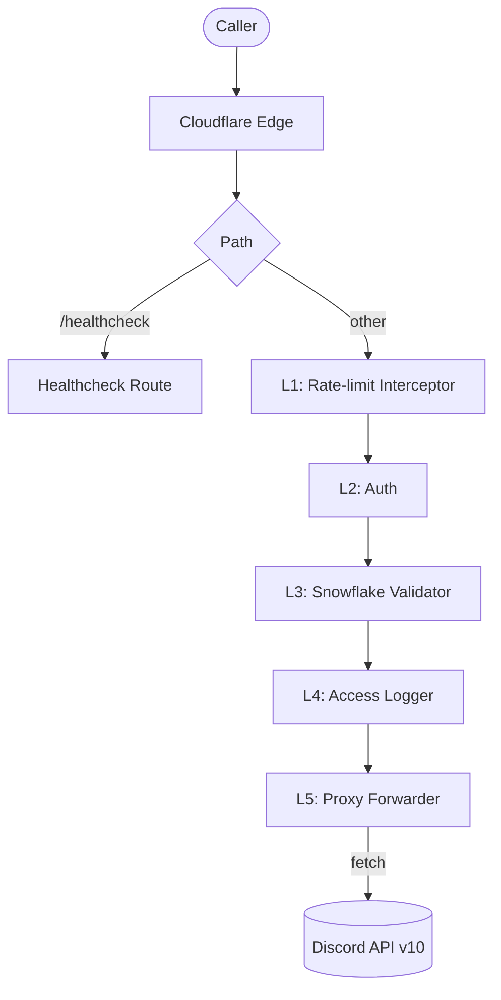

# cf-discord-relay

[](https://github.com/Synertry/cf-discord-relay/actions/workflows/ci.yaml)
[](https://github.com/Synertry/cf-discord-relay/actions/workflows/deploy.yaml)
[](https://workers.cloudflare.com/)
[](https://hono.dev/)
[](https://bun.sh/)
[](./LICENSE)

A self-hosted, token-free Discord API relay on Cloudflare Workers. Point any environment blocked by Discord's IP rules (Google Apps Script, restricted VPSes, corporate egress filters, anywhere Cloudflare's bot challenges fire) at your relay and call the Discord API as if you were not blocked. Callers carry their own credentials. The relay holds none of its own.

## Why this exists

Many environments cannot reach `discord.com/api` because their egress IPs land on Cloudflare's challenge list. Google Apps Script's `UrlFetchApp` is the canonical example, but the same pattern turns up on shared VPSes, corporate proxies, low-reputation hosting ranges, and tightened cellular NAT.

The fix is to put a known-good origin between the caller and Discord. `cf-discord-relay` is that origin: a single Cloudflare Worker, one shared secret, no Discord tokens of its own.

## Quick start

> **First-time operator?** See [`docs/DEPLOY.md`](./docs/DEPLOY.md) for the full step-by-step walkthrough (Cloudflare prerequisites, label sync, GitHub PAT, branch protection, troubleshooting). The recap below is the experienced-operator version.

You need [Bun](https://bun.sh) installed, a Cloudflare account, and a domain delegated to Cloudflare DNS for the relay.

1. Fork this repo.
2. `bun install`.
3. Set the Worker's shared secret. If this is your first Wrangler use on the machine, run `bun wrangler login` to authenticate against your Cloudflare account. Then generate a long random value and pipe it into the `AUTH_KEY` secret:

   ```powershell
   # PowerShell (Windows)
   $key = [Convert]::ToBase64String([byte[]](1..48 | % { Get-Random -Max 256 }))
   $key | bun wrangler secret put AUTH_KEY --env production
   ```

   ```bash
   # Bash / Zsh (macOS, Linux, WSL, Git Bash)
   key=$(openssl rand -base64 48)
   echo "$key" | bun wrangler secret put AUTH_KEY --env production
   ```

   Hold on to `$key`, your callers send it as the `x-auth-key` header.

4. Add the following GitHub Actions repo secrets (all required unless marked optional) under `Settings` > `Secrets and variables` > `Actions`:

   | Secret | Purpose |
   |---|---|
   | `CLOUDFLARE_API_TOKEN` | Wrangler deploy auth |
   | `CLOUDFLARE_ACCOUNT_ID` | Cloudflare account ID |
   | `CUSTOM_DOMAIN` | Relay hostname substituted into `wrangler.jsonc` (e.g. `relay.example.com`) |
   | `DISCORD_WEBHOOK_URL` | Where deploy notifications are posted |
   | `PAT` | Personal access token used for cross-branch pushes (CI -> production PR, `/approve` fast-forward) |
   | `AUTH_KEY` *(optional)* | Same value as the Worker secret. Enables [dogfeeding deploy notifications](#dogfeed-deploy-notifications). |

5. Push to the `production` branch. The deploy workflow uploads via `wrangler versions upload` and promotes via `wrangler versions deploy`.

Verify with `curl https://<your-domain>/healthcheck`. It returns 200 JSON with build metadata and is the only path that does not require `x-auth-key`.

## Usage

### From Google Apps Script (the canonical case)

Take your existing Discord webhook URL, swap the host for the relay's, and send the relay's secret as `x-auth-key`. Store the secret in Script Properties, never in source.

```javascript
const WEBHOOK_URL = "https://<your-domain>/webhooks/<webhook_id>/<webhook_token>";

function onSubmit(e) {
    // Store the relay's shared secret (same value as the Worker AUTH_KEY)
    // under Project Settings -> Script Properties.
    const AUTH_KEY = PropertiesService.getScriptProperties().getProperty("AUTH_KEY");

    // ... build your embed payload from the form response here ...

    UrlFetchApp.fetch(WEBHOOK_URL, {
        method: "post",
        contentType: "application/json",
        muteHttpExceptions: true,
        headers: { "x-auth-key": AUTH_KEY },
        payload: JSON.stringify({ embeds: [/* ... */] })
    });
}
```

The body is whatever Discord's webhook API expects (`content`, `embeds`, `username`, etc.). The relay never inspects it.

### Other Discord endpoints

Any Discord API v10 path works. The relay rewrites `https://<your-domain>/{path}` to `https://discord.com/api/v10/{path}`. For bot-token endpoints, send your `Authorization: Bot xxx` header alongside `x-auth-key`. The relay strips `x-auth-key` before forwarding and passes `Authorization` through verbatim.

```bash
# Webhook POST through the relay
curl -X POST \
     -H "x-auth-key: $AUTH_KEY" \
     -H "Content-Type: application/json" \
     -d '{"content":"hello from the relay"}' \
     "https://<your-domain>/webhooks/<webhook_id>/<webhook_token>"

# Bot endpoint through the relay
curl -H "x-auth-key: $AUTH_KEY" \
     -H "Authorization: Bot $BOT_TOKEN" \
     "https://<your-domain>/users/@me"
```

## Middleware sieve

Every request other than `/healthcheck` walks through a five-layer sieve before reaching Discord. Together they reject malformed traffic early, log every request with constant overhead, and present a uniform envelope on rate-limit hits.



| Layer | What it does |
|---|---|
| 1. Rate-limit Interceptor | Wraps the downstream response. On a 429, replaces the body with `{"error":"Too Many Requests","retryAfter":<seconds>}` and preserves Discord's `Retry-After` and `X-RateLimit-*` headers. |
| 2. Auth | Validates `x-auth-key` against the `AUTH_KEY` Worker secret using `crypto.subtle.timingSafeEqual`. Rejects with 401 (wrong key) or 503 (binding unset). |
| 3. Snowflake Validator | Scans the URL path for Discord resource keywords (`/channels`, `/guilds`, `/messages`, ...) and checks the following segment is a 17-to-20-digit snowflake or a documented virtual ID (`/users/@me`, `/messages/bulk-delete`, ...). Rejects malformed IDs with Discord's own `code: 50035` envelope. |
| 4. Access Logger | Writes one structured line to Cloudflare Workers logs after the response is finalized. Webhook tokens in the path are redacted. The `Authorization` header is never read or logged. |
| 5. Proxy Forwarder | Strips `Host`, `x-auth-key`, `x-proxy-context`. `fetch`es `https://discord.com/api/v10{path}{query}` with `AbortSignal.timeout(60_000)` and `duplex: 'half'` for streamed bodies. Returns 504 on timeout, 502 on other upstream failures. |

## Endpoints

| Path | Auth | Notes |
|---|---|---|
| `GET /healthcheck` | None | Public liveness probe. Returns 200 JSON with `status`, `service`, `build.hash`, `build.timestamp`, and `time`. `Cache-Control: no-store`. |
| `/*` (everything else) | `x-auth-key` | Catch-all proxy. Method, path, query, body, and most headers passed through. |

## Response shapes the relay generates

Anything not in this table is Discord's response passed through unchanged.

| Status | Body | Triggered by |
|---|---|---|
| `400` | `{"message":"Invalid Form Body","code":50035,"errors":...}` | A path segment that should be a Discord snowflake is not. Discord-compatible shape so client error handlers built for the Discord API keep working. |
| `401` | `{"error":"Unauthorized"}` | Missing or wrong `x-auth-key`. |
| `404` | `{"error":"Not Found"}` | No route matched in the relay (this is the relay's notFound, not Discord's). JSON for Google Apps Script compatibility. |
| `429` | `{"error":"Too Many Requests","retryAfter":<seconds\|null>}` | Discord's 429 reformatted. Discord's `Retry-After` and `X-RateLimit-*` headers are preserved on the response. |
| `500` | `{"error":"Internal Server Error"}` | Unhandled exception in the Hono pipeline. |
| `502` | `{"error":"Bad gateway","detail":"<error name>"}` | Outbound fetch failed for non-timeout reasons (DNS, TLS, runtime kill, ...). `detail` carries the error name. |
| `503` | `{"error":"Service misconfigured"}` | `AUTH_KEY` binding is not set. |
| `504` | `{"error":"Upstream timeout","detail":"TimeoutError"\|"AbortError"}` | Discord did not respond within 60 seconds, or the client disconnected mid-flight. |

## What gets forwarded, what gets stripped

Forwarded to Discord: method, path, query string, request body, every caller header except those listed below.

Stripped from outbound requests: `Host`, `x-auth-key`, `x-proxy-context`.

Returned to caller: Discord's response unchanged, except the 429 reformatting from Layer 1 above.

## Limitations

- HTTP only. No Gateway / WebSocket support. The relay does not proxy `wss://gateway.discord.gg`.
- Body bytes are forwarded as-is. No file or multipart upload transforms, no streaming response rewrites. Multipart works up to Cloudflare Workers' standard request size limit.
- One shared `AUTH_KEY`. No per-caller identity or scope. A compromised key gives full relay access.
- Discord API v10 is hardcoded into the path rewrite. No version negotiation.

## Dogfeed deploy notifications

`notify.yaml` can post the deploy embed via your own relay and falls back to a direct Discord call if the relay is unreachable. The fallback keeps deploy notifications working when the Worker is down, the custom domain is misconfigured, or `AUTH_KEY` is rotated mid-deploy.

To enable, add `AUTH_KEY` to GitHub Actions repo secrets with the same value as the Worker secret. The existing `CUSTOM_DOMAIN` secret is reused as the relay host. If either secret is unset, `notify.yaml` posts straight to `DISCORD_WEBHOOK_URL` without going through the relay.

## Logs

One structured line per inbound request to Cloudflare Workers logs:

```
[req] 200    142ms POST   /webhooks/123456789012345678/***   ip=2a01:4f8:abcd::1 ua="Mozilla/5.0 (compatible; Google-Apps-Script)" origin=https://script.google.com
```

Webhook tokens in the path are redacted to `***`. The `Authorization` header value is never logged.

## Contributing

See [`.github/CONTRIBUTING.md`](./.github/CONTRIBUTING.md) for branching, workflow, code style, and local development.

## License

[Boost Software License 1.0](https://www.boost.org/LICENSE_1_0.txt). See [LICENSE](./LICENSE).

## Acknowledgements

Adapted from [Synertry/discord-api-proxy](https://github.com/Synertry/discord-api-proxy), trimmed to a minimal token-free pass-through.
